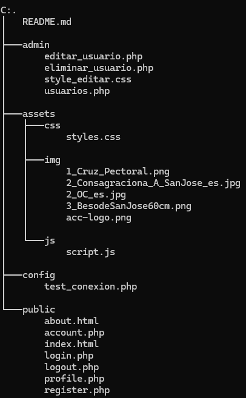

# 📖 Anglican CelestiArte - Gestión de Usuarios

Este proyecto es un sistema de **gestión de usuarios** que permite:
✅ **Registro e inicio de sesión** con autenticación segura.  
✅ **Gestión de usuarios** (visualizar, editar y eliminar).  
✅ **Paginación para mostrar usuarios en páginas de 10 registros**.  
✅ **Roles de usuario y administrador** para restringir accesos.  

## 🛠️ **Instalación y Configuración**
### 1️⃣ **Requisitos**
- XAMPP o cualquier servidor con **Apache y MySQL**.
- PHP 7.4+.
- Base de datos MySQL.

### 2️⃣ **Configuración de la Base de Datos**
1. **Abrir phpMyAdmin** (`http://localhost:1903/phpmyadmin/`).
2. **Ejecutar el siguiente SQL para crear la base de datos y la tabla `usuarios`:**

```sql
CREATE DATABASE anglican_celestiarte;
USE anglican_celestiarte;

CREATE TABLE usuarios (
    id INT AUTO_INCREMENT PRIMARY KEY,
    nombre VARCHAR(100) NOT NULL,
    email VARCHAR(100) NOT NULL UNIQUE,
    password VARCHAR(255) NOT NULL,
    rol ENUM('Usuario', 'Administrador') DEFAULT 'Usuario'
);
```
### 3️⃣ **Configurar la conexión a MySQL en /config/test_conexion.php:**

```php
<?php
$host = "localhost";
$user = "root";
$password = "";
$database = "anglican_celestiarte";

$conexion = new mysqli($host, $user, $password, $database);

if ($conexion->connect_error) {
    die("Error de conexión: " . $conexion->connect_error);
}
?>
```

### 📜 Explicación de Cada Archivo



#### 📂 /public/ (Archivos Accesibles)
- **index.php** → Página de inicio del proyecto.
- **about.php** → Página de información sobre el proyecto.
- **account.php** → Página de cuenta de usuario (registro/inicio de sesión).
- **usuarios.php** → Lista de usuarios paginada (solo accesible por administradores).

#### 📂 /admin/ (Gestión de Usuarios)
- **editar_usuario.php** → Permite a los administradores editar un usuario.
- **eliminar_usuario.php** → Lógica para eliminar un usuario.
- **register.php** → Procesa el registro de nuevos usuarios.
- **login.php** → Autenticación de usuarios.
- **logout.php** → Cierra sesión y redirige a account.php.

#### 📂 /config/ (Configuración del Sistema)
- **test_conexion.php** → Verifica si la conexión a MySQL está funcionando.

#### 📂 /assets/ (Recursos Estáticos)
##### 📂 /css/ → Contiene los estilos CSS.
- **styles.css** → Estilos generales para toda la web.
- **style_editar.css** → Estilos específicos para la edición de usuarios.

##### 📂 /js/ → Contiene los scripts JS.
- **script.js** → Funciones para paginación y validaciones.

##### 📂 /img/ → Contiene imágenes, como el logo del proyecto.

### 📌 Funcionalidades Clave

#### 🔹 Gestión de Usuarios
- Los usuarios pueden registrarse e iniciar sesión en **account.php**.
- Solo los administradores pueden ver y gestionar otros usuarios (**usuarios.php**).

#### 🔹 Paginación en la Lista de Usuarios
- **usuarios.php** muestra 10 usuarios por página con botones para navegar entre páginas.

#### 🔹 Autenticación y Seguridad
- Se usa `password_hash()` para cifrar contraseñas en MySQL.
- Protección de accesos: los administradores pueden editar o eliminar usuarios, pero los usuarios normales no tienen acceso a esas funciones.

#### 🔹 Edición de Usuarios
- Los administradores pueden editar nombre, correo y rol de cualquier usuario en **editar_usuario.php**.

#### 🔹 Eliminación de Usuarios
- Un administrador puede eliminar un usuario, pero no puede eliminarse a sí mismo.

## 📌 Cómo Probar el Proyecto

1️⃣ Arrancar Apache y MySQL en XAMPP.  
2️⃣ Guardar la carpeta **C:\xampp\htdocs**  
3️⃣ Abrir el navegador y acceder a:  
- **Inicio**: [http://localhost/anglican_celestiarte/public/index.php](http://localhost/anglican_celestiarte/public/index.html)    